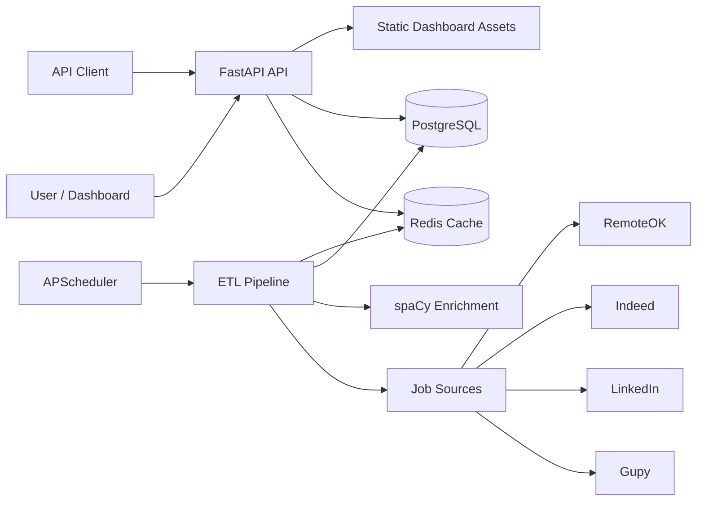
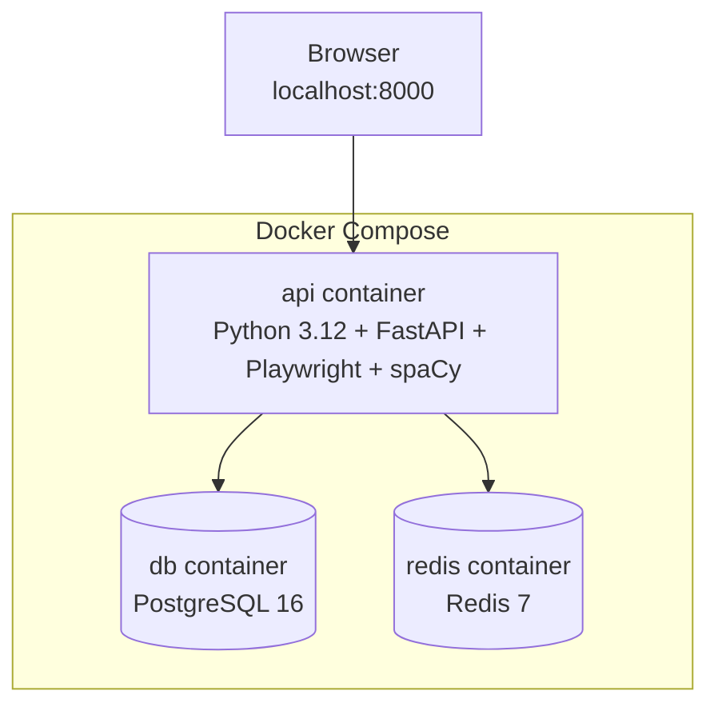
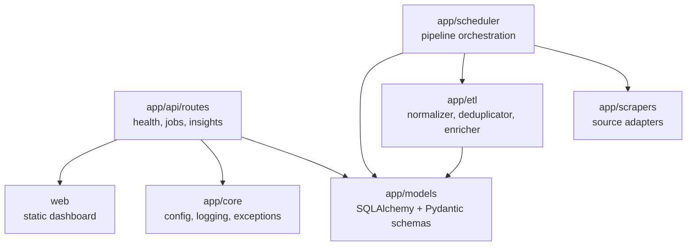
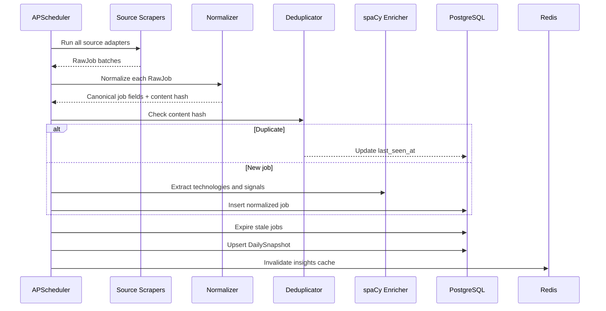
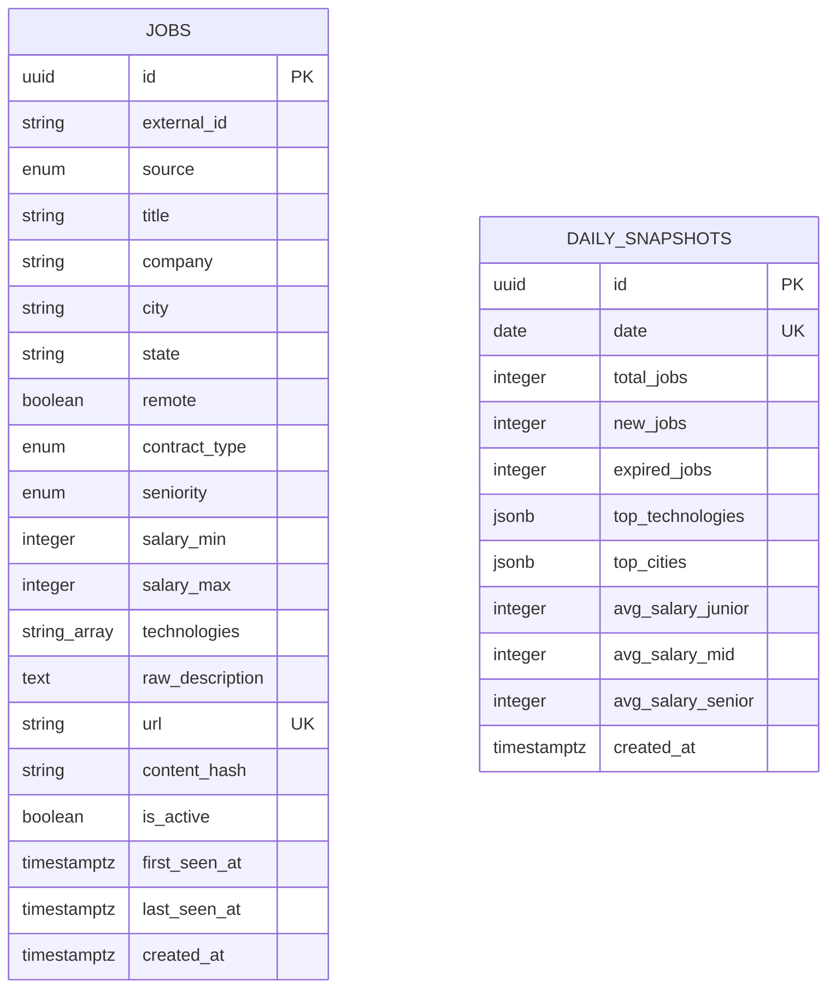
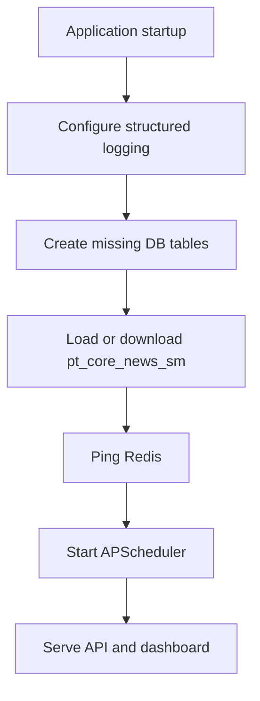

# Architecture

`br-dev-jobs` is an ETL and analytics system for Brazilian developer job listings. It collects job posts from multiple sources, normalizes them into a common schema, enriches them with NLP-derived signals, stores them in PostgreSQL, and serves search and market insights through FastAPI.

## System Context



## Runtime Topology

The Docker Compose stack runs three services:

| Service | Image/build | Responsibility |
|---|---|---|
| `api` | Local Dockerfile | FastAPI app, dashboard serving, scheduler, scraping pipeline, NLP enrichment |
| `db` | `postgres:16-alpine` | Persistent storage for jobs and daily snapshots |
| `redis` | `redis:7-alpine` | API response caching and insights cache invalidation |



## Application Layers



### API Layer

The FastAPI application is defined in `app/main.py`. It mounts the static dashboard at `/`, exposes OpenAPI docs at `/api/docs`, and registers versioned API routes under `/api/v1`.

Main route groups:

| Route group | Purpose |
|---|---|
| `/api/v1/health` | Database, Redis, and scraper freshness checks |
| `/api/v1/jobs` | Job listing search, filtering, sorting, pagination, and job detail |
| `/api/v1/insights` | Aggregated market metrics, technology trends, and salary analytics |

### Scheduler Layer

The scheduler uses APScheduler with an interval trigger controlled by `SCRAPE_INTERVAL_HOURS`. On application startup, the scheduler starts and triggers the first pipeline run immediately.

The manual pipeline entrypoint is:

```bash
docker compose exec api python -c "from app.scheduler.jobs import run_full_pipeline; import asyncio; asyncio.run(run_full_pipeline())"
```

This is wrapped by:

```bash
make scrape
```

### Scraper Layer

Each source has an adapter under `app/scrapers`. Scrapers return `RawJob` records and isolate source-specific collection logic from the rest of the system.

Current sources:

| Source | Adapter |
|---|---|
| Gupy | `app/scrapers/gupy.py` |
| LinkedIn | `app/scrapers/linkedin.py` |
| Indeed | `app/scrapers/indeed.py` |
| RemoteOK | `app/scrapers/remoteok.py` |

Scrapers run concurrently with a semaphore limit configured by `MAX_CONCURRENT_SCRAPERS`.

## ETL Flow



Pipeline stages:

1. Scrape all enabled sources concurrently.
2. Normalize raw listings into a canonical data model.
3. Compute and check `content_hash` to avoid duplicate listings.
4. Extract technology mentions with spaCy-backed enrichment.
5. Insert new jobs or refresh `last_seen_at` for known jobs.
6. Mark jobs inactive when they have not been seen for the stale window.
7. Upsert the daily market snapshot.
8. Clear cached insight responses.

## Data Model



### `jobs`

Stores the canonical representation of a job listing. The table is optimized for filtering by source, activity state, seniority, location, remote status, salary, and technologies.

Important fields:

| Field | Purpose |
|---|---|
| `url` | Unique source URL used as a hard uniqueness guard |
| `content_hash` | Fast duplicate detection across repeated runs |
| `technologies` | PostgreSQL array used for technology filters and aggregations |
| `first_seen_at` | When the job first entered the dataset |
| `last_seen_at` | Refreshed when a duplicate is found in a later scrape |
| `is_active` | Marks stale listings without deleting historical data |

### `daily_snapshots`

Stores daily aggregate metrics used by the dashboard and insight APIs. Snapshots make trend analysis cheaper and preserve historical market state.

## Caching Strategy

Redis is used for read-heavy API responses:

| Cache key family | Producer | Invalidated by |
|---|---|---|
| `jobs:list:*` | `/api/v1/jobs` list endpoint | TTL expiration |
| `insights:*` | `/api/v1/insights` endpoints | Pipeline completion |

Job listing cache entries use `CACHE_TTL_SECONDS`. Insight cache entries use longer endpoint-level TTLs and are explicitly invalidated after the ETL pipeline finishes.

## Startup Lifecycle



During startup, the app verifies core dependencies early so misconfiguration is visible in logs. Database table creation is suitable for local/dev usage; production deployments should prefer Alembic migrations.

## Configuration

Configuration is loaded from environment variables and `.env` through Pydantic Settings.

| Variable | Default | Purpose |
|---|---|---|
| `APP_NAME` | `br-dev-jobs` | Application name |
| `DEBUG` | `false` | Enables debug behavior and SQL echo |
| `LOG_LEVEL` | `INFO` | Logging verbosity |
| `DATABASE_URL` | Local PostgreSQL URL | Async SQLAlchemy connection URL |
| `REDIS_URL` | Local Redis URL | Redis connection URL |
| `SCRAPE_INTERVAL_HOURS` | `6` | Scheduler interval |
| `MAX_CONCURRENT_SCRAPERS` | `4` | Scraper concurrency limit |
| `PLAYWRIGHT_HEADLESS` | `true` | Browser mode for Playwright scrapers |
| `GUPY_API_URL` | Gupy public API URL | Gupy source endpoint |
| `REMOTEOK_RSS_URL` | RemoteOK RSS URL | RemoteOK source endpoint |
| `CACHE_TTL_SECONDS` | `300` | Job listing cache TTL |
| `CORS_ALLOW_ORIGINS` | `*` | Allowed CORS origins |

## Reliability Notes

- Scraper failures are isolated at the source adapter level and should not stop the whole pipeline.
- Duplicate detection updates `last_seen_at` instead of rewriting existing rows.
- Stale jobs are soft-expired with `is_active = false`.
- Insight caches are invalidated only after a full pipeline run completes.
- API health checks include database, Redis, and inferred scraper freshness.

## Deployment Notes

The runtime image installs only production dependencies, Chromium, Chromium Driver, the Playwright Chromium browser, and `pt_core_news_sm`. The container runs as `appuser`.

For production hardening, consider:

- Running Alembic migrations as an explicit release step.
- Moving the scheduler into a separate worker process if horizontal API scaling is needed.
- Adding persistent observability: metrics, traces, and structured log aggregation.
- Setting a restrictive `CORS_ALLOW_ORIGINS` value.
- Adding rate limiting around public API endpoints and scraper-triggering operations.
